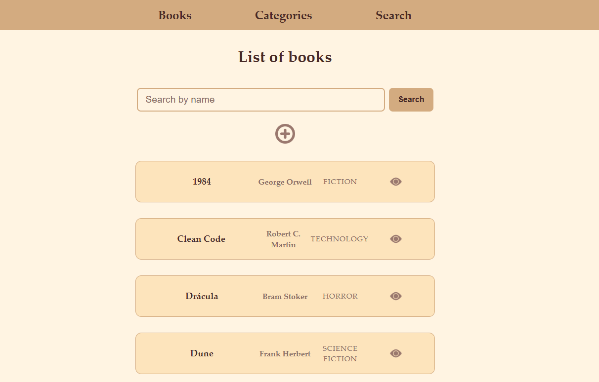
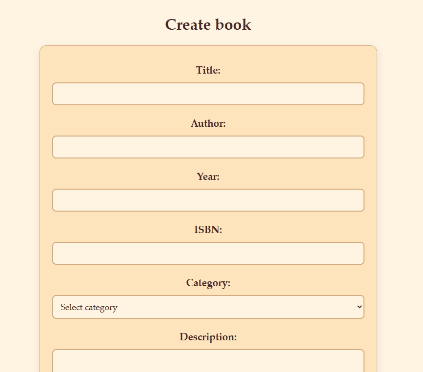

# Inventory App

## Description
Inventory management application built with Node.js and Express.

## Features
- CRUD products
- Categories
- Form validation
- MVC architecture

## Tech Stack
- Node.js
- Express
- EJS
- Psotgresql

## Getting Started
1. Clone the repo
2. npm install
3. npm run dev

## Screenshots

## Database Setup

This project uses PostgreSQL locally.

1. Create the database manually
2. Run the schema:

psql -U user -d db
\i db/schema.sql

3. Seed the database:

node db/seed.js